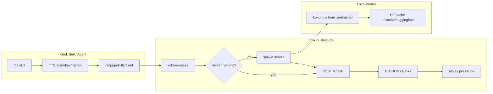

# PRD: Grok Build CLI TTS

**Project:** grok-build-cli-tts  
**Author:** Chris + Grok Build  
**Date:** 2026-06-08  
**Status:** Draft  
**Repo (planned):** https://github.com/cdiak/grok-build-cli-tts (public)

---

## 1. Problem Statement

Grok Build users can run `/tts` to turn code, terminal output, or a recent assistant reply into a **spoken technical narration**. Today that workflow works end-to-end on one machine, but it is not portable:

| Pain | Detail |
|------|--------|
| **Hardcoded paths** | The skill invokes `~/Development/Projects/Obsidian Plugins/obsidian-tts/bin/kokoro-speak` — a path only valid on the author's machine. |
| **Wrong abstraction** | Playback depends on an Obsidian plugin repo. Teammates who only use Grok Build have no reason to clone an Obsidian vault plugin. |
| **Undocumented model setup** | Kokoro weights download implicitly on first server start via `kokoro-js`, but nothing in the skill explains prerequisites, cache location, or first-run timing. |
| **Oversized modules** | The working server (`index.js`, 349 LOC) and client (`kokoro-speak.mjs`, 345 LOC) exceed the ~150 LOC/file cap used elsewhere in the author's projects. |

**Goal:** A minimal, public, Grok-Build-native package that any user can install once, plus a generalized `/tts` skill that discovers it without machine-specific paths.

---

## 2. Vision

Two deliverables in one repository:

1. **`grok-build-cli-tts`** — a standalone local Kokoro playback stack (HTTP server + CLI client). No Obsidian dependency.
2. **`.grok/skills/tts/SKILL.md`** — agent instructions for speech-ready script generation and optional local playback, referencing the standalone tools via PATH or env vars.

A new teammate's experience:

```text
git clone https://github.com/cdiak/grok-build-cli-tts
cd grok-build-cli-tts && ./bin/install
# copy or symlink .grok/skills/tts → ~/.grok/skills/tts  (or add repo to config.toml [skills].paths)
grok
/tts recent
# → markdown script appears in chat; Kokoro plays it within seconds (after first model download)
```

---

## 3. Current State (What We Have)

### 3.1 Grok `/tts` skill (`~/.grok/skills/tts/SKILL.md`)

**Agent-side (no code):** Converts source material into TTS-friendly markdown:

- Modes: `recent`, file, directory/repo, terminal, `no-play`
- Structure: `##` per file, `###` per function; workflow order, not alphabetical
- Symbol → speech rules (snake_case, arrows, types described not punctuated)
- Output: one markdown document ending with `<!-- tts:end -->`

**Playback-side (shell):** After writing the script:

1. Save body to `/tmp/grok-tts-<timestamp>.md`
2. Run `kokoro-speak` on that file
3. On failure, append one line: `Playback failed: …`

Env overrides already defined: `KOKORO_SERVER_DIR`, `KOKORO_PORT`, `KOKORO_VOICE`, `KOKORO_KEEP_SERVER`.

### 3.2 Obsidian TTS Kokoro stack (source to extract)

| Component | Role | LOC |
|-----------|------|-----|
| `server/index.js` | HTTP server: load model, `GET /status`, `POST /speak` (NDJSON stream), `POST /synthesize` | 349 |
| `server/lib/model-config.js` | Model ID, dtype (`q4`), CoreML EP on darwin | 23 |
| `server/lib/wav.js` | Float32 PCM → WAV buffer | 27 |
| `bin/kokoro-speak.mjs` | Markdown stripper, server lifecycle, stream client, `afplay` playback | 345 |
| `bin/kokoro-server` | Bash daemon starter | 28 |
| `bin/kokoro-speak` | Bash wrapper → `.mjs` | 4 |

**Model loading:** `kokoro-js` → `KokoroTTS.from_pretrained("onnx-community/Kokoro-82M-v1.0-ONNX", { dtype: "q4", session_options: { executionProviders: ["coreml","cpu"] } })` on macOS.

**First run:** Hugging Face Hub download triggered by `from_pretrained` progress callback (~hundreds of MB for q4 ONNX). Cache defaults to `~/.cache/huggingface/hub/` unless `HF_HOME` / `HUGGINGFACE_HUB_CACHE` is set.

**Playback:** macOS `afplay` per sentence chunk as NDJSON arrives. Linux throws unless `--no-play`.

**What we do NOT port:** Obsidian plugin UI, chunk pipeline, highlight manager, settings tab, esbuild bundle — all unrelated to Grok `/tts`.

---

## 4. Requirements

### 4.1 Functional

| ID | Requirement |
|----|-------------|
| F1 | `kokoro-speak <file.md>` strips markdown (headers, fences, HTML comments) and plays speakable text. |
| F2 | `kokoro-speak --text "…"` and stdin (`-`) work for short tests. |
| F3 | `kokoro-server` starts a background daemon; subsequent `kokoro-speak` calls reuse it. |
| F4 | Server exposes `GET /status`, `POST /speak` (NDJSON), `POST /synthesize` (batch JSON) — same contract as today so the skill needs no protocol changes. |
| F5 | Model auto-download on first server start; `install` script documents prerequisites and verifies Node ≥ 18. |
| F6 | Generalized `SKILL.md` discovers tools via: (a) `kokoro-speak` on PATH, (b) `GROK_TTS_HOME` env, (c) sibling `bin/` relative to skill install path. No author-specific absolute paths. |
| F7 | `no-play` mode unchanged — script only, for ElevenLabs or manual paste. |
| F8 | Repo ships install docs: clone, `npm install`, optional PATH setup, first-run model download expectations. |

### 4.2 Non-Functional

| ID | Requirement |
|----|-------------|
| N1 | **≤150 LOC per file** (hard cap); prefer ~10 LOC per leaf transformation. |
| N2 | **Handcrafted layout:** `bin/` entry only, `lib/` reasoning, `var/` state, `docs/` spec. |
| N3 | **Fail loud:** synthesis or server errors surface clearly; no silent fallback audio. |
| N4 | **Minimal dependencies:** `kokoro-js` (+ Node built-ins). No Obsidian, no bundler for the CLI stack. |
| N5 | **Public docs** describe Grok Build only — no employer-specific branding. |
| N6 | MIT license; credit Kokoro-82M and kokoro-js. |

### 4.3 Platform (v1)

| Platform | Synthesis | Playback |
|----------|-----------|----------|
| macOS Apple Silicon | CoreML + q4 ONNX (primary) | `afplay` |
| macOS Intel | CPU ONNX | `afplay` |
| Linux | CPU ONNX (`--no-play` or WAV out) | Deferred (v2: `aplay`/`paplay`) |
| Windows | Out of scope v1 | Out of scope v1 |

---

## 5. Proposed Architecture

### 5.1 Directory layout

```text
grok-build-cli-tts/
├── bin/
│   ├── install           # verify node, npm ci, print PATH hint
│   ├── kokoro-speak      # bash → node lib/cli/speak.mjs
│   └── kokoro-server     # bash daemon starter
├── lib/
│   ├── cli/
│   │   ├── speak.mjs         # argv parse, orchestration only
│   │   ├── markdown-strip.mjs
│   │   ├── server-lifecycle.mjs
│   │   └── stream-playback.mjs
│   └── server/
│       ├── index.mjs         # listen + route dispatch only
│       ├── model-loader.mjs
│       ├── model-config.mjs
│       ├── wav.mjs
│       ├── routes-status.mjs
│       ├── routes-synthesize.mjs
│       ├── routes-speak.mjs
│       └── speak-queue.mjs
├── var/                  # gitignored runtime (pid, optional logs pointer)
├── docs/
│   ├── PRD.md            # this file
│   ├── SETUP.md          # user-facing install + model guide
│   └── API.md            # HTTP contract for debugging
├── .grok/
│   └── skills/
│       └── tts/
│           └── SKILL.md  # generalized agent skill (or publish copy instructions)
├── package.json          # single package; server deps at root
└── README.md
```

### 5.2 Data flow



### 5.3 Module decomposition (from obsidian-tts)

| New module | Extracted from | Responsibility | Target LOC |
|------------|----------------|----------------|------------|
| `model-config.mjs` | `server/lib/model-config.js` | EP, dtype, model ID env | ~25 |
| `wav.mjs` | `server/lib/wav.js` | PCM → WAV | ~30 |
| `model-loader.mjs` | `server/index.js` `loadModel` | HF download + ready flag | ~60 |
| `speak-queue.mjs` | `server/index.js` queue | Serialize concurrent /speak | ~40 |
| `routes-speak.mjs` | `server/index.js` stream handler | NDJSON stream | ~80 |
| `routes-synthesize.mjs` | `server/index.js` batch | JSON + base64 WAV | ~50 |
| `routes-status.mjs` | `server/index.js` status | Health + voices | ~30 |
| `index.mjs` | `server/index.js` main | HTTP listen, CORS, dispatch | ~60 |
| `markdown-strip.mjs` | `kokoro-speak.mjs` | `markdownToSpeakable` | ~40 |
| `server-lifecycle.mjs` | `kokoro-speak.mjs` | ensureServer, waitForReady | ~70 |
| `stream-playback.mjs` | `kokoro-speak.mjs` | NDJSON read, afplay, concat WAV | ~90 |
| `speak.mjs` | `kokoro-speak.mjs` main | argv, wire modules | ~50 |

Every file stays under 150 LOC; largest pieces (`routes-speak`, `stream-playback`) remain splittable if they grow.

### 5.4 Tool discovery (skill rewrite)

Replace hardcoded paths with this resolution order:

1. `GROK_TTS_HOME/bin/kokoro-speak` if `GROK_TTS_HOME` is set
2. `kokoro-speak` on `PATH` (recommended after `./bin/install` or `npm link`)
3. If skill lives at `<repo>/.grok/skills/tts/`, use `<repo>/bin/kokoro-speak` (repo-scoped install)

Document in `SETUP.md` and skill frontmatter `compatibility: Requires grok-build-cli-tts, Node ≥18, macOS for playback`.

---

## 6. Kokoro Model Setup (User Documentation)

`docs/SETUP.md` will teach:

### 6.1 Prerequisites

- Node.js ≥ 18 (`node --version`)
- macOS for audible playback (Linux: `--no-play --out speech.wav`)
- ~500 MB disk for cached ONNX weights (first download)
- Network on first run only

### 6.2 Install steps

```bash
git clone https://github.com/cdiak/grok-build-cli-tts.git
cd grok-build-cli-tts
./bin/install          # npm ci, sanity check
export PATH="$PWD/bin:$PATH"   # or symlink into ~/.local/bin
```

### 6.3 First model fetch (automatic)

Starting the server (explicitly or via `kokoro-speak`) calls:

```text
onnx-community/Kokoro-82M-v1.0-ONNX  (dtype q4 on Apple Silicon)
```

Weights download to the Hugging Face cache. Users can override:

| Env var | Effect |
|---------|--------|
| `HF_HOME` | Relocate all HF cache |
| `HUGGINGFACE_HUB_CACHE` | Hub-specific cache dir |
| `KOKORO_MODEL_ID` | Alternate model repo |
| `KOKORO_DTYPE` | e.g. `fp16`, `q4` |
| `HF_TOKEN` | Gated models (not required for public Kokoro ONNX) |

**Expected first-run timing:** 1–3 minutes download + 5–15 s model load on Apple Silicon. Status visible at `GET http://127.0.0.1:19200/status` (`ready: true` when done).

### 6.4 Smoke test

```bash
kokoro-speak --text "Grok Build TTS is working."
curl -s http://127.0.0.1:19200/status | python3 -m json.tool
```

### 6.5 Skill install

```bash
# Option A: user scope
cp -r .grok/skills/tts ~/.grok/skills/tts

# Option B: config.toml
# [skills]
# paths = ["~/grok-build-cli-tts/.grok/skills/tts"]
```

---

## 7. Skill Changes (SKILL.md diff summary)

| Section | Today | Target |
|---------|-------|--------|
| Description | "…via local Kokoro (obsidian-tts)" | "…via local Kokoro (grok-build-cli-tts)" |
| Tool path | Absolute obsidian-tts path | Discovery order (§5.4) |
| Server contract | Points at `obsidian-tts/server/index.js` | Points at `lib/server/index.mjs` in this repo |
| Setup | None | Link to `docs/SETUP.md` in skill `references/` or inline "Prerequisites" |
| `compatibility` frontmatter | Missing | `Node ≥18, grok-build-cli-tts on PATH, macOS for playback` |

**Unchanged:** narration rules, modes, markdown structure, `no-play`, env vars `KOKORO_*`, temp file convention, quality checklist.

---

## 8. Distribution

| Channel | Contents |
|---------|----------|
| **GitHub** `cdiak/grok-build-cli-tts` | Full repo: CLI + skill + docs |
| **Grok skill** | `.grok/skills/tts/` committed in repo; users copy or add `[skills].paths` |
| **Future (optional)** | Grok plugin manifest bundling skill + install hook — not v1 |

`.gitignore`: `node_modules/`, `var/`, OS junk.

---

## 9. Implementation Phases

### Phase 0 — Planning (this PRD) ✓

Align on scope, layout, line budget. Collect author's additional programming constraints.

### Phase 1 — Extract & decompose (MVP)

- [ ] Scaffold handcrafted layout
- [ ] Port server + client from obsidian-tts into `lib/` modules (≤150 LOC each)
- [ ] `bin/install` + `docs/SETUP.md`
- [ ] Smoke test: `--text`, markdown file, warm server

### Phase 2 — Generalized skill

- [ ] Rewrite `.grok/skills/tts/SKILL.md` (no absolute paths)
- [ ] Add `references/setup-summary.md` symlink or excerpt for agent context
- [ ] Author dogfoods from `~/.grok/skills/tts` copy or `[skills].paths`

### Phase 3 — Publish

- [ ] `README.md` (Grok Build focused)
- [ ] `docs/API.md`
- [ ] GitHub public repo, MIT LICENSE
- [ ] Retire obsidian-tts path references in personal `~/.grok/skills/tts`

### Phase 4 — Hardening (post-MVP)

- [ ] Linux audio backend
- [ ] `grok inspect` compatibility string tested
- [ ] Optional: pre-warm hook in shell profile

---

## 10. Success Criteria

| Check | Pass condition |
|-------|----------------|
| Fresh clone | New machine (macOS): install → smoke test → hear speech in <5 min after download |
| Skill portable | `SKILL.md` contains zero user-specific paths |
| Module size | `wc -l` on every `lib/**` file ≤ 150 |
| Parity | Same `/speak` NDJSON contract; existing `kokoro-speak` flags preserved |
| Isolation | Repo has no Obsidian imports or references |
| Docs | `SETUP.md` explains model download without referring to any plugin |

---

## 11. Non-Goals (v1)

- Cloud TTS (ElevenLabs integration beyond `no-play` copy-paste)
- Word-level highlight / seek (Obsidian plugin features)
- Windows support
- Bundling Kokoro weights in the repo (HF cache only)
- npm publish / global `npx` package (git clone is enough for teammates)

---

## 12. Risks & Mitigations

| Risk | Mitigation |
|------|------------|
| First-run download fails (corporate network) | Document `HF_ENDPOINT`, manual `huggingface-cli download`, offline cache copy |
| CoreML EP fails on some Macs | Fall back to CPU via env; log EP chain in `/status` |
| Long repo narrations timeout | Keep `KOKORO_SPEAK_TIMEOUT_MS` (default 600000); document for REPO mode |
| Skill not found | Document both copy-to-`~/.grok/skills` and `config.toml` paths |
| Module split churn | FD header per `lib/` file; spec in `docs/` before code |

---

## 13. Open Questions (for next session)

1. **Author programming constraints** — user mentioned additional ideas beyond handcrafted; reconcile before Phase 1 coding.
2. **Package manager** — single root `package.json` vs nested `server/package.json` (today's layout)? Recommendation: single root for simpler `install`.
3. **ESM vs CJS** — obsidian server is CJS; client is ESM. Unify on ESM (`"type": "module"`) for Node ≥18?
4. **Repo naming** — `grok-build-cli-tts` vs `grok-tts` for brevity on PATH?
5. **Voice default** — keep `af_sky` or document team preference?
6. **Bundled skill name** — keep `tts` (may collide with user skills) or `grok-tts`?

---

## 14. References

- Kokoro-82M: https://huggingface.co/hexgrad/Kokoro-82M
- ONNX build: https://huggingface.co/onnx-community/Kokoro-82M-v1.0-ONNX
- kokoro-js: https://www.npmjs.com/package/kokoro-js
- Grok skills guide: `~/.grok/docs/user-guide/08-skills.md`
- Source extraction: Obsidian TTS plugin `server/` + `bin/kokoro-speak.mjs` (author's local copy)